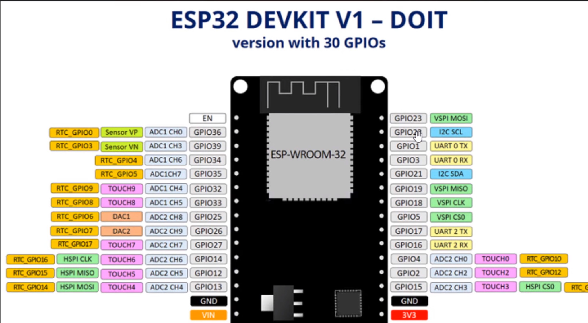

# ESP32 Programming using Arduino IDE

The PIN layout of the ESP-WROOM-32 Board is present in the following image


## Initial environment and chip configuration

## Problems
* Problem connecting to port, specially in Arduino IDE [^1]. Give permission to access the port, by your user, with the following commands:
    ```
    sudo adduser <username> dialout
    sudo chmod a+rw /dev/ttyUSB0
    ```
* Problem for computer to recognize ESP32-CAM-MB (with micro-usb included) [^2], use the following commands:
	```
	systemctl stop brltty-udev.service
	sudo systemctl mask brltty-udev.service
	systemctl stop brltty.service
	systemctl disable brltty.service
	```

[^1]: https://stackoverflow.com/questions/73923341/unable-to-flash-esp32-the-port-doesnt-exist
[^2]: https://stackoverflow.com/questions/76188030/esp32-cam-does-not-appear-on-com-ports-in-windows-or-on-dev-tty-in-linux
